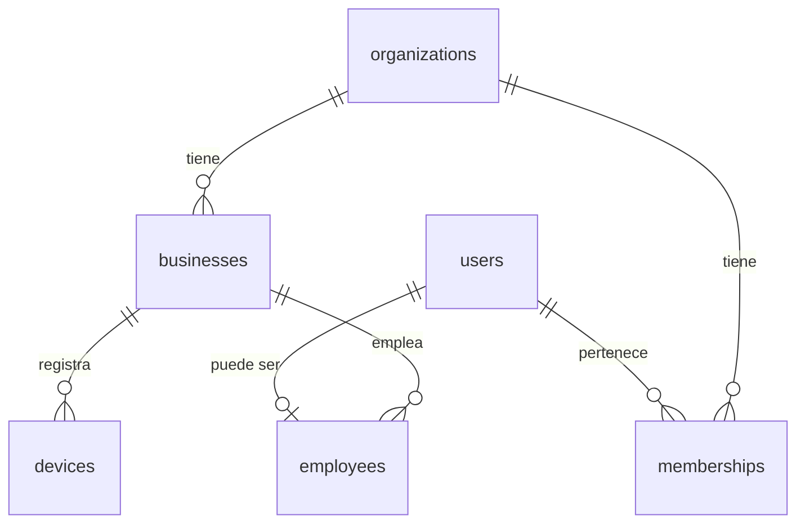
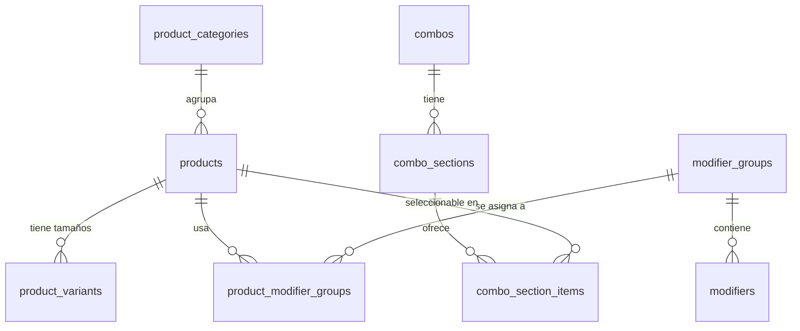
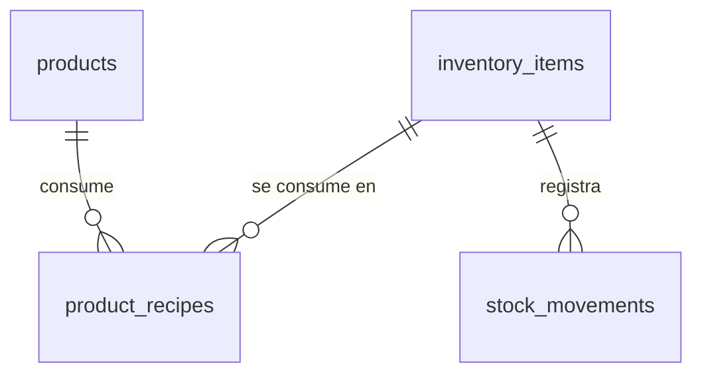
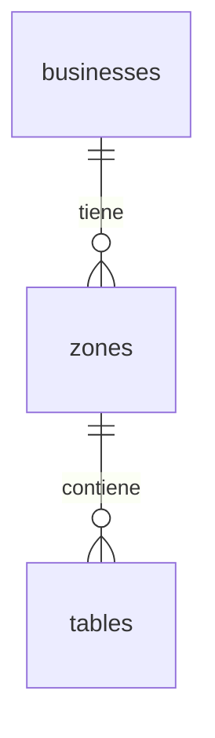
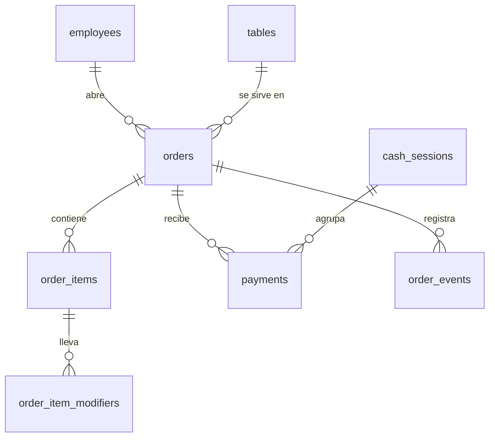
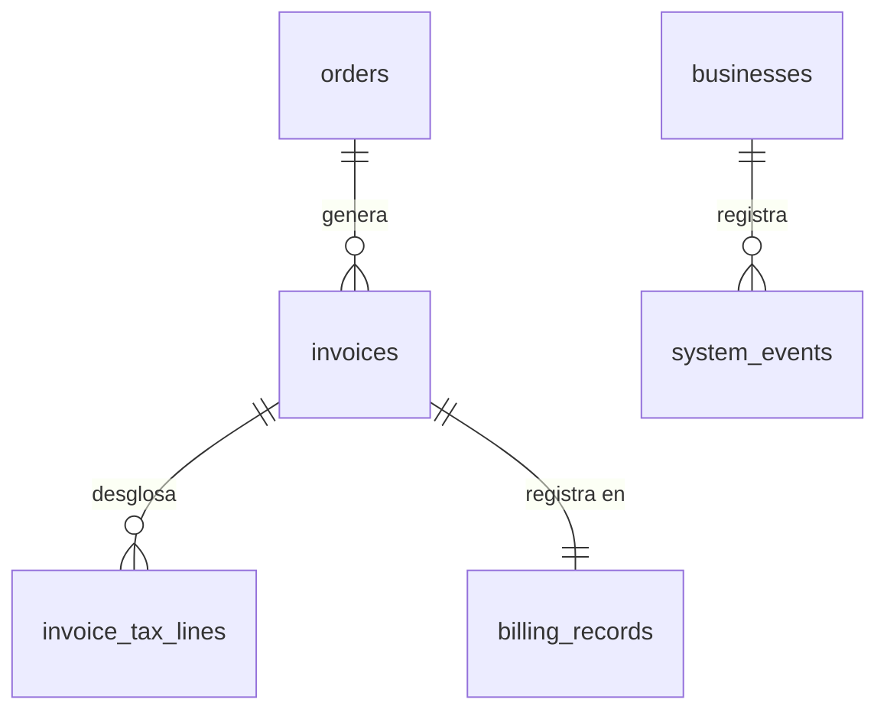

# Esquema de base de datos — next-TPV

> Fuente de verdad del modelo de datos. PostgreSQL (Supabase).
> Escrito para nivel principiante: cada tabla se explica en español, pero los **nombres de tablas y columnas van en inglés** (estándar profesional).
> Si vas a implementar o modificar la BD, **lee este documento en vez de re-escanear el código**.

---

## Principios de diseño (léelos antes que nada)

1. **Multi-tenant (multi-negocio):** casi todas las tablas llevan `business_id`. Los datos de cada bar están aislados. En Supabase esto se refuerza con **Row Level Security (RLS)**: un usuario solo puede ver filas de su negocio.
2. **Jerarquía de cuentas:** `organizations` (la cuenta cliente que paga) → `businesses` (los locales de esa cuenta). Un dueño puede tener varios bares. Esto habilita el multi-local sin rehacer nada.
3. **El dinero se guarda en céntimos (enteros), nunca con decimales `float`.** `4,50 €` se guarda como `450`. Esto evita errores de redondeo. Regla de oro en software de dinero.
4. **"Snapshots" en las ventas:** cuando se vende algo, la línea de comanda **copia** el nombre, precio e IVA del producto en ese momento. Si mañana cambias el precio del café, los tickets antiguos no deben cambiar. La venta es una foto del pasado.
5. **Inmutabilidad legal:** las tablas de facturación (`billing_records`, `invoices`, `system_events`) son **de solo añadir** (append-only). Nunca se editan ni se borran. Lo exige Veri*factu.
6. **Timestamps en todo:** `created_at` y `updated_at` en todas las tablas. Para trazabilidad.
7. **Borrado lógico (soft delete):** en catálogo/config usamos `is_active` o `deleted_at` en vez de borrar de verdad (para no romper históricos). **Excepción:** lo legal nunca se borra ni se marca como borrado.
8. **IDs con UUID:** claves primarias `uuid` (mejor para sistemas distribuidos/offline que autoincrementales).

---

## Mapa de módulos

| Módulo | Tablas | Para qué |
|--------|--------|----------|
| 1. Cuentas y multi-tenant | `organizations`, `businesses`, `users`, `memberships`, `employees`, `devices` | Quién es cliente, sus locales, quién entra y con qué rol |
| 2. Catálogo | `product_categories`, `products`, `product_variants`, `modifier_groups`, `modifiers`, `product_modifier_groups`, `combos`, `combo_sections`, `combo_section_items` | La carta: productos, tamaños, extras, menús |
| 3. Inventario | `inventory_items`, `product_recipes`, `stock_movements` | Stock y escandallos (diseñado ya, se activa luego) |
| 4. Sala y mesas | `zones`, `tables` | Plano visual de salón/terraza/barra |
| 5. Comandas y caja | `orders`, `order_items`, `order_item_modifiers`, `payments`, `cash_sessions`, `order_events` | Comandas, líneas, cobros, arqueo, divisiones |
| 6. Facturación legal (Veri*factu) | `invoices`, `invoice_tax_lines`, `billing_records`, `system_events` | Tickets/facturas, hash encadenado, QR, envío AEAT |

---

## Módulo 1 — Cuentas y multi-tenant

### organizations
La cuenta cliente (quien paga la suscripción). Puede tener varios locales.

| Columna | Tipo | Notas |
|---|---|---|
| id | uuid PK | |
| name | text | Nombre de la cuenta (ej. "Bar de Paco S.L.") |
| owner_user_id | uuid FK→users | Dueño principal |
| subscription_plan | text | free / basic / pro |
| subscription_status | text | trialing / active / past_due / canceled |
| trial_ends_at | timestamptz | |
| created_at, updated_at | timestamptz | |

### businesses
Un local físico (el bar). Aquí van los datos fiscales que salen en el ticket.

| Columna | Tipo | Notas |
|---|---|---|
| id | uuid PK | |
| organization_id | uuid FK→organizations | |
| name | text | Nombre comercial |
| legal_name | text | Razón social |
| tax_id | text | NIF/CIF |
| address, city, postal_code, province | text | Dirección fiscal |
| country | text | default 'ES' |
| phone, email | text | |
| logo_url | text | |
| timezone | text | default 'Europe/Madrid' |
| currency | text | default 'EUR' |
| verifactu_mode | text (enum) | 'verifactu' / 'no_verifactu' / 'disabled' |
| invoice_series | text | Serie de facturación (ej. 'A') |
| is_active | boolean | |
| created_at, updated_at | timestamptz | |

### users
Personas que inician sesión en el **panel de administración** (email + contraseña). Se apoya en **Supabase Auth** (`auth.users`); esta tabla es el perfil público. `id` = el UID de Supabase Auth.

| Columna | Tipo | Notas |
|---|---|---|
| id | uuid PK | = auth.users.id |
| full_name | text | |
| email | text | |
| avatar_url | text | |
| created_at, updated_at | timestamptz | |

### memberships
Relaciona un `user` con una `organization` y su rol a nivel de cuenta (por si en el futuro varias personas gestionan la cuenta).

| Columna | Tipo | Notas |
|---|---|---|
| id | uuid PK | |
| user_id | uuid FK→users | |
| organization_id | uuid FK→organizations | |
| role | text (enum) | 'owner' / 'admin' / 'staff' |
| created_at | timestamptz | |

### employees
Los **trabajadores que usan el TPV con un PIN**. Aquí está el requisito que pediste: nombre, foto, rol admin/trabajador, y sus ventas (vía `orders.employee_id`).

| Columna | Tipo | Notas |
|---|---|---|
| id | uuid PK | |
| business_id | uuid FK→businesses | |
| user_id | uuid FK→users (nullable) | Si además tiene acceso al panel |
| name | text | Nombre visible |
| avatar_url | text | Foto de perfil |
| pin_hash | text | El código PIN **hasheado** (nunca en texto plano) |
| role | text (enum) | 'admin' / 'manager' / 'worker' |
| hourly_wage_cents | integer (nullable) | Para fichaje futuro |
| is_active | boolean | |
| created_at, updated_at | timestamptz | |

### devices
Cada terminal registrado (caja, tablet de camarero, pantalla de cocina). Útil para el SaaS y **obligatorio para Veri*factu** (hay que saber qué dispositivo emitió cada ticket).

| Columna | Tipo | Notas |
|---|---|---|
| id | uuid PK | |
| business_id | uuid FK→businesses | |
| name | text | ej. "Caja principal" |
| type | text (enum) | 'pos_terminal' / 'waiter_tablet' / 'kds' / 'printer' |
| last_seen_at | timestamptz | |
| is_active | boolean | |
| created_at | timestamptz | |

---

## Módulo 2 — Catálogo (la carta)

### product_categories
Categorías de la carta (Cafés, Cañas, Raciones...). Admite subcategorías vía `parent_id`.

| Columna | Tipo | Notas |
|---|---|---|
| id | uuid PK | |
| business_id | uuid FK | |
| parent_id | uuid FK→product_categories (nullable) | Subcategorías |
| name | text | |
| color | text | Color del botón en el TPV |
| icon | text | |
| display_order | integer | Orden de aparición |
| is_active | boolean | |

### products
Producto vendible. Puede ser simple, tener variantes, modificadores, o ser un combo/menú (`is_combo`).

| Columna | Tipo | Notas |
|---|---|---|
| id | uuid PK | |
| business_id | uuid FK | |
| category_id | uuid FK→product_categories | |
| name | text | |
| description | text | |
| image_url | text | **Foto del producto** (la que pediste) |
| base_price_cents | integer | Precio base en céntimos |
| tax_rate | numeric(5,2) | % de IVA (ej. 10.00, 21.00) |
| is_combo | boolean | Si es menú/combo |
| track_stock | boolean | Si descuenta inventario |
| sku | text | Código para inventario |
| display_order | integer | |
| is_active | boolean | |
| created_at, updated_at | timestamptz | |

### product_variants
Tamaños/variantes (caña / doble / tercio; café solo / con leche). Cada variante tiene su precio.

| Columna | Tipo | Notas |
|---|---|---|
| id | uuid PK | |
| product_id | uuid FK→products | |
| name | text | ej. "Doble" |
| price_cents | integer | Precio **absoluto** de esta variante |
| sku | text | |
| is_default | boolean | Variante por defecto |
| display_order | integer | |
| is_active | boolean | |

### modifier_groups
Grupos de modificadores ("Punto de la carne", "Extras", "Quitar ingredientes"). Definen cuántas opciones se pueden elegir.

| Columna | Tipo | Notas |
|---|---|---|
| id | uuid PK | |
| business_id | uuid FK | |
| name | text | |
| min_select | integer | Mínimo a elegir (0 = opcional) |
| max_select | integer | Máximo (1 = una sola) |
| is_required | boolean | |

### modifiers
Las opciones concretas ("Sin hielo" +0€, "Extra queso" +1€).

| Columna | Tipo | Notas |
|---|---|---|
| id | uuid PK | |
| modifier_group_id | uuid FK→modifier_groups | |
| name | text | |
| price_delta_cents | integer | Puede ser 0 o negativo |
| display_order | integer | |
| is_active | boolean | |

### product_modifier_groups
Tabla puente: qué grupos de modificadores aplican a qué producto.

| Columna | Tipo | Notas |
|---|---|---|
| product_id | uuid FK→products | PK compuesta |
| modifier_group_id | uuid FK→modifier_groups | PK compuesta |
| display_order | integer | |

### combos / combo_sections / combo_section_items
Menús (menú del día = primero + segundo + bebida por precio fijo). Un `product` con `is_combo=true` tiene **secciones** (Primero, Segundo, Bebida) y cada sección ofrece varios productos elegibles.

**combo_sections**

| Columna | Tipo | Notas |
|---|---|---|
| id | uuid PK | |
| combo_product_id | uuid FK→products | El producto-combo |
| name | text | ej. "Primero" |
| min_select, max_select | integer | Normalmente 1 y 1 |
| display_order | integer | |

**combo_section_items**

| Columna | Tipo | Notas |
|---|---|---|
| id | uuid PK | |
| combo_section_id | uuid FK→combo_sections | |
| product_id | uuid FK→products | Producto elegible |
| price_delta_cents | integer | Suplemento (ej. "solomillo +3€") |

---

## Módulo 3 — Inventario (diseñado ya, se activa luego)

### inventory_items
Materias primas o artículos con stock (botellas, kilos de café...).

| Columna | Tipo | Notas |
|---|---|---|
| id | uuid PK | |
| business_id | uuid FK | |
| name | text | |
| unit | text | 'unit' / 'kg' / 'l' |
| current_stock | numeric(12,3) | Existencias actuales |
| min_stock | numeric(12,3) | Aviso de bajo stock |
| cost_price_cents | integer | Coste por unidad |
| is_active | boolean | |

### product_recipes (escandallos)
Cuánto inventario consume un producto al venderse.

| Columna | Tipo | Notas |
|---|---|---|
| id | uuid PK | |
| product_id | uuid FK→products | |
| inventory_item_id | uuid FK→inventory_items | |
| quantity | numeric(12,3) | Cantidad consumida por venta |

### stock_movements
Historial de entradas/salidas de stock (append-only).

| Columna | Tipo | Notas |
|---|---|---|
| id | uuid PK | |
| business_id | uuid FK | |
| inventory_item_id | uuid FK→inventory_items | |
| type | text (enum) | 'purchase' / 'sale' / 'adjustment' / 'waste' |
| quantity | numeric(12,3) | + entra, − sale |
| reason | text | |
| order_id | uuid FK→orders (nullable) | Si viene de una venta |
| employee_id | uuid FK→employees (nullable) | |
| created_at | timestamptz | |

---

## Módulo 4 — Sala y mesas (plano visual)

### zones
Zonas del local (Salón, Terraza, Barra).

| Columna | Tipo | Notas |
|---|---|---|
| id | uuid PK | |
| business_id | uuid FK | |
| name | text | |
| display_order | integer | |
| background_url | text (nullable) | Imagen de fondo del plano |
| is_active | boolean | |

### tables
Mesas colocadas en el plano con **coordenadas** (para el editor visual).

| Columna | Tipo | Notas |
|---|---|---|
| id | uuid PK | |
| business_id | uuid FK | |
| zone_id | uuid FK→zones | |
| name | text | Número/nombre de mesa |
| pos_x, pos_y | integer | Posición en el plano |
| width, height | integer | Tamaño |
| shape | text (enum) | 'square' / 'round' |
| seats | integer | Comensales |
| status | text (enum) | 'free' / 'occupied' / 'billing' / 'reserved' |
| current_order_id | uuid FK→orders (nullable) | Comanda abierta ahora |
| is_active | boolean | |

---

## Módulo 5 — Comandas y caja

### orders (comanda / cuenta)
La cuenta de una mesa. Se puede **aparcar** (dejar abierta) y volver. Soporta dividir/juntar/transferir.

| Columna | Tipo | Notas |
|---|---|---|
| id | uuid PK | |
| business_id | uuid FK | |
| order_number | integer | Correlativo por negocio |
| type | text (enum) | 'dine_in' / 'takeaway' / 'delivery' / 'counter' |
| status | text (enum) | 'open' / 'paid' / 'cancelled' |
| zone_id | uuid FK→zones (nullable) | |
| table_id | uuid FK→tables (nullable) | |
| employee_id | uuid FK→employees | Quién la abrió (**ventas por empleado**) |
| guest_count | integer | |
| subtotal_cents | integer | |
| tax_total_cents | integer | |
| discount_total_cents | integer | |
| total_cents | integer | |
| notes | text | |
| merged_into_order_id | uuid FK→orders (nullable) | Para **juntar mesas** |
| split_from_order_id | uuid FK→orders (nullable) | Para **dividir cuenta** |
| cash_session_id | uuid FK→cash_sessions (nullable) | Arqueo |
| opened_at, closed_at | timestamptz | |
| created_at, updated_at | timestamptz | |

### order_items (líneas de comanda)
Cada producto añadido. Guarda **snapshots** de nombre/precio/IVA (no cambian aunque cambie el producto).

| Columna | Tipo | Notas |
|---|---|---|
| id | uuid PK | |
| order_id | uuid FK→orders | |
| product_id | uuid FK→products (nullable) | Referencia (puede desaparecer el producto) |
| variant_id | uuid FK→product_variants (nullable) | |
| name_snapshot | text | Nombre en el momento de la venta |
| unit_price_cents | integer | Precio en el momento |
| quantity | integer | |
| tax_rate | numeric(5,2) | IVA en el momento |
| line_total_cents | integer | Total de la línea (con modificadores) |
| course | text (nullable) | Curso: 'starter'/'main'/'drink' |
| notes | text | ej. "poco hecho" |
| status | text (enum) | 'pending' / 'sent' / 'preparing' / 'ready' / 'served' / 'cancelled' |
| sent_to_kitchen_at | timestamptz (nullable) | |
| created_by | uuid FK→employees | |
| created_at, updated_at | timestamptz | |

### order_item_modifiers
Modificadores elegidos en una línea (también con snapshot de precio).

| Columna | Tipo | Notas |
|---|---|---|
| id | uuid PK | |
| order_item_id | uuid FK→order_items | |
| modifier_id | uuid FK→modifiers (nullable) | |
| name_snapshot | text | |
| price_delta_cents | integer | |

### payments
Cobros de una comanda. Varios pagos por comanda = **pago mixto** o **cuenta dividida**.

| Columna | Tipo | Notas |
|---|---|---|
| id | uuid PK | |
| business_id | uuid FK | |
| order_id | uuid FK→orders | |
| cash_session_id | uuid FK→cash_sessions (nullable) | |
| method | text (enum) | 'cash' / 'card' / 'other' |
| amount_cents | integer | |
| tip_cents | integer | Propina |
| cash_received_cents | integer (nullable) | Efectivo recibido |
| change_cents | integer (nullable) | Cambio devuelto |
| employee_id | uuid FK→employees | |
| created_at | timestamptz | |

### cash_sessions (arqueo de caja / cierre Z)
Sesión de caja: apertura con fondo, cierre con recuento.

| Columna | Tipo | Notas |
|---|---|---|
| id | uuid PK | |
| business_id | uuid FK | |
| device_id | uuid FK→devices (nullable) | |
| opened_by | uuid FK→employees | |
| opened_at | timestamptz | |
| opening_amount_cents | integer | Fondo de caja |
| closed_by | uuid FK→employees (nullable) | |
| closed_at | timestamptz (nullable) | |
| counted_amount_cents | integer (nullable) | Recuento real |
| expected_amount_cents | integer (nullable) | Lo que debería haber |
| difference_cents | integer (nullable) | Descuadre |
| status | text (enum) | 'open' / 'closed' |

### order_events (auditoría de comandas)
Registro de acciones sobre comandas (abrir, transferir, juntar, anular línea...). Útil para trazabilidad y control interno.

| Columna | Tipo | Notas |
|---|---|---|
| id | uuid PK | |
| order_id | uuid FK→orders | |
| business_id | uuid FK | |
| event_type | text | 'created' / 'item_added' / 'transferred' / 'merged' / 'split' / 'item_voided' ... |
| employee_id | uuid FK→employees | |
| payload | jsonb | Detalle del evento |
| created_at | timestamptz | |

---

## Módulo 6 — Facturación legal Veri*factu (tablas ahora, envío AEAT en Fase 2)

> ⚖️ **Zona crítica legal.** Estas tablas son **append-only**: nunca se hace UPDATE ni DELETE. El encadenamiento por hash es lo que garantiza la inalterabilidad que exige el RD 1007/2023.

### invoices (facturas / tickets)
Cada ticket (factura simplificada) o factura completa emitida.

| Columna | Tipo | Notas |
|---|---|---|
| id | uuid PK | |
| business_id | uuid FK | |
| order_id | uuid FK→orders | |
| invoice_type | text (enum) | 'simplified' (ticket) / 'complete' (factura con datos fiscales) |
| series | text | Serie (ej. 'A') |
| number | integer | **Correlativo por serie, sin huecos** |
| issue_date | timestamptz | |
| customer_tax_id | text (nullable) | NIF del cliente (factura completa) |
| customer_name | text (nullable) | |
| customer_address | text (nullable) | |
| subtotal_cents | integer | Base imponible total |
| tax_total_cents | integer | IVA total |
| total_cents | integer | |
| device_id | uuid FK→devices | Qué terminal la emitió |
| employee_id | uuid FK→employees | |
| created_at | timestamptz | |

### invoice_tax_lines (desglose de IVA)
Una línea por cada tipo de IVA de la factura (obligatorio desglosar).

| Columna | Tipo | Notas |
|---|---|---|
| id | uuid PK | |
| invoice_id | uuid FK→invoices | |
| tax_rate | numeric(5,2) | ej. 10.00 |
| base_cents | integer | Base imponible a ese tipo |
| tax_cents | integer | Cuota de IVA |

### billing_records (registro de facturación Veri*factu) — EL CORAZÓN LEGAL
Un registro por cada factura, **encadenado por hash** con el anterior. Contiene el QR y el estado de envío a la AEAT.

| Columna | Tipo | Notas |
|---|---|---|
| id | uuid PK | |
| business_id | uuid FK | |
| invoice_id | uuid FK→invoices | |
| record_type | text (enum) | 'registration' (alta) / 'cancellation' (anulación) |
| sequence_number | bigint | Orden en la cadena, por negocio |
| hash | text | Hash **de este** registro |
| previous_hash | text | Hash del registro anterior (encadenamiento) |
| hash_algorithm | text | ej. 'SHA-256' |
| qr_content | text | Contenido del QR (URL de verificación AEAT) |
| signature | text (nullable) | Firma electrónica (modo no_verifactu) |
| software_id | text | Identificador del SIF (tu software) |
| software_version | text | |
| aeat_status | text (enum) | 'pending' / 'sent' / 'accepted' / 'rejected' |
| aeat_sent_at | timestamptz (nullable) | |
| aeat_response | jsonb (nullable) | Respuesta de la Agencia Tributaria |
| created_at | timestamptz | |

> **Reglas de esta tabla:** (1) nunca UPDATE/DELETE; (2) para "corregir" se emite un nuevo registro de tipo `cancellation` + uno nuevo de alta; (3) `previous_hash` del primer registro = valor semilla acordado; (4) el cálculo del hash debe seguir **exactamente** la especificación técnica de la AEAT vigente en el momento de implementar.

### system_events (registro de eventos del SIF)
Log de eventos del sistema que exige la normativa (arranque, inicio de sesión, cambios de configuración, incidencias...).

| Columna | Tipo | Notas |
|---|---|---|
| id | uuid PK | |
| business_id | uuid FK | |
| device_id | uuid FK→devices (nullable) | |
| employee_id | uuid FK→employees (nullable) | |
| event_type | text | 'sif_start' / 'login' / 'config_change' / 'incident' ... |
| payload | jsonb | |
| created_at | timestamptz | |

---

## Notas de implementación (para la Fase 2 / cuando toque)

- **RLS en Supabase:** activar Row Level Security en todas las tablas con `business_id`, con políticas que filtren por el negocio del usuario autenticado. Nada de datos cruzados entre bares.
- **Offline-first:** en la app de escritorio (Electron) habrá una copia local (SQLite) que sincroniza. Las tablas de ventas necesitan tolerar IDs generados offline (por eso UUID) y resolución de conflictos por `updated_at`.
- **Numeración de facturas sin huecos:** el `number` correlativo por serie debe generarse de forma atómica (secuencia/transacción) — requisito legal.
- **Índices recomendados:** `business_id` en todas; `(business_id, status)` en `orders`; `(order_id)` en `order_items` y `payments`; `(business_id, sequence_number)` único en `billing_records`.
- **No implementar el hash a ojo:** cuando llegue la Fase 2, buscar la **especificación técnica oficial de la AEAT vigente** para el formato exacto del hash y del QR. No inventarlo.

---

*Este esquema cubre el MVP y deja preparado el SaaS completo. Cualquier cambio estructural se refleja PRIMERO aquí y luego en el código (migraciones Drizzle).*
