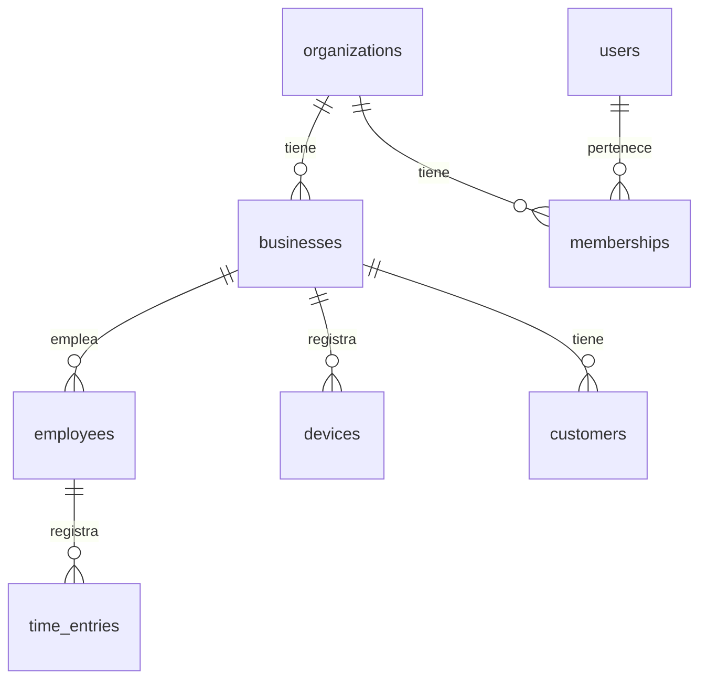
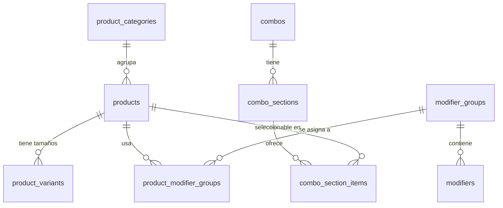
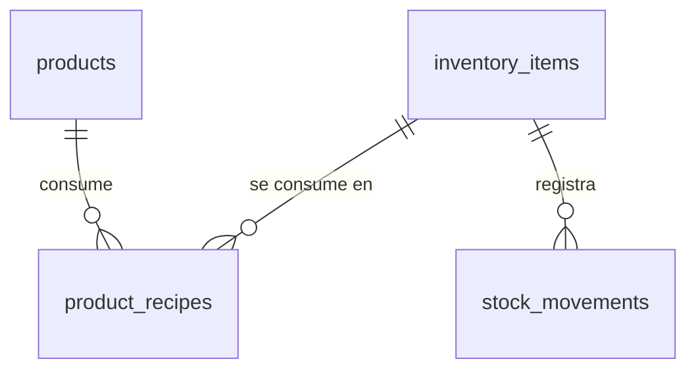
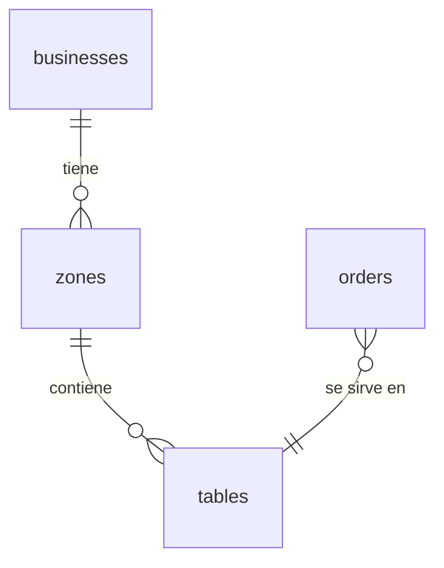
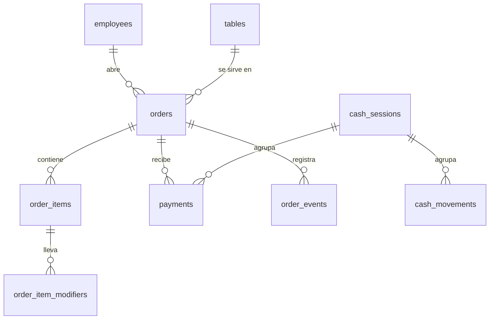
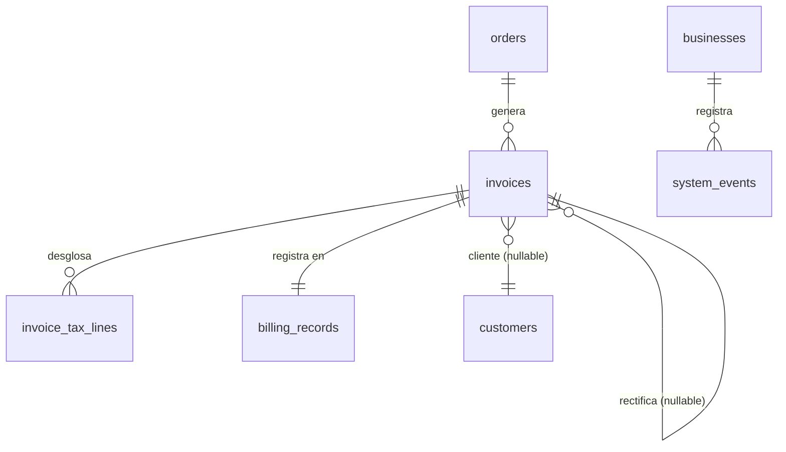

# Esquema de base de datos — next-TPV

> Fuente de verdad del modelo de datos. PostgreSQL (Supabase).
> Escrito para nivel principiante: cada tabla se explica en español, pero los **nombres de tablas y columnas van en inglés** (estándar profesional).
> Si vas a implementar o modificar la BD, **lee este documento en vez de re-escanear el código**.

---

## Principios de diseño (léelos antes que nada)

1. **Multi-tenant (multi-negocio):** casi todas las tablas llevan `business_id`. Los datos de cada bar están aislados. En Supabase esto se refuerza con **Row Level Security (RLS)**: un usuario solo puede ver filas de su negocio.
2. **Jerarquía de cuentas:** `organizations` (la cuenta cliente que paga) → `businesses` (los locales de esa cuenta). Un dueño puede tener varios bares. Esto habilita el multi-local sin rehacer nada.
3. **El dinero se guarda en céntimos (enteros), nunca con decimales `float`.** `4,50 €` se guarda como `450`. Esto evita errores de redondeo. Regla de oro en software de dinero.
4. **"Snapshots" en las ventas:** cuando se vende algo, la línea de comanda **copia** el nombre, precio e IVA del producto en ese momento. Si mañana cambias el precio del café, los tickets antiguos no deben cambiar. La venta es una foto del pasado.
5. **Inmutabilidad legal:** las tablas de facturación (`billing_records`, `invoices`, `invoice_tax_lines`, `system_events`) son **de solo añadir** (append-only). Nunca se editan ni se borran. Lo exige Veri*factu.
6. **Timestamps en todo:** `created_at` y `updated_at` en todas las tablas. Para trazabilidad.
7. **Borrado lógico (soft delete):** en catálogo/config usamos `is_active` o `deleted_at` en vez de borrar de verdad (para no romper históricos). **Excepción:** lo legal nunca se borra ni se marca como borrado.
8. **IDs con UUID:** claves primarias `uuid` (mejor para sistemas distribuidos/offline que autoincrementales).

---

## Mapa de módulos

| Módulo | Tablas | Para qué |
|--------|--------|----------|
| 1. Cuentas y multi-tenant | `organizations`, `businesses`, `users`, `memberships`, `employees`, `devices`, `customers`, `time_entries` | Quién es cliente, sus locales, quién entra y con qué rol, clientes habituales, registro de jornada |
| 2. Catálogo | `product_categories`, `products`, `product_variants`, `modifier_groups`, `modifiers`, `product_modifier_groups`, `combos`, `combo_sections`, `combo_section_items` | La carta: productos con alérgenos, tamaños, extras, menús |
| 3. Inventario | `inventory_items`, `product_recipes`, `stock_movements` | Stock y escandallos (diseñado ya, se activa en Fase 3) |
| 4. Sala y mesas | `zones`, `tables` | Plano visual de salón/terraza/barra |
| 5. Comandas y caja | `orders`, `order_items`, `order_item_modifiers`, `payments`, `cash_sessions`, `cash_movements`, `order_events` | Comandas, líneas, cobros, arqueo, movimientos de caja, divisiones |
| 6. Facturación legal (Veri*factu) | `invoices`, `invoice_tax_lines`, `billing_records`, `system_events` | Tickets/facturas, hash encadenado, QR, envío AEAT |

---

## Módulo 1 — Cuentas y multi-tenant

### organizations
La cuenta cliente (quien paga la suscripción). Puede tener varios locales.

| Columna | Tipo | Notas |
|---|---|---|
| id | uuid PK | |
| name | text | Nombre de la cuenta (ej. "Bar de Paco S.L.") |
| owner_user_id | uuid FK→users | Dueño principal |
| subscription_plan | text | free / basic / pro |
| subscription_status | text | trialing / active / past_due / canceled |
| trial_ends_at | timestamptz | |
| created_at, updated_at | timestamptz | |

### businesses
Un local físico (el bar). Aquí van los datos fiscales que salen en el ticket.

| Columna | Tipo | Notas |
|---|---|---|
| id | uuid PK | |
| organization_id | uuid FK→organizations | |
| name | text | Nombre comercial |
| legal_name | text | Razón social |
| tax_id | text | NIF/CIF |
| address, city, postal_code, province | text | Dirección fiscal |
| country | text | default 'ES' |
| phone, email | text | |
| logo_url | text | |
| timezone | text | default 'Europe/Madrid' |
| currency | text | default 'EUR' |
| verifactu_mode | text (enum) | 'verifactu' / 'no_verifactu' / 'disabled' |
| invoice_series | text | Serie de facturación. **Incluye el año** (ej. `A2027`); rotación anual automática. Verificar convención con gestor. |
| is_active | boolean | |
| created_at, updated_at | timestamptz | |

### users
Personas que inician sesión en el **panel de administración** (email + contraseña). Se apoya en **Supabase Auth** (`auth.users`); esta tabla es el perfil público. `id` = el UID de Supabase Auth.

| Columna | Tipo | Notas |
|---|---|---|
| id | uuid PK | = auth.users.id |
| full_name | text | |
| email | text | |
| avatar_url | text | |
| created_at, updated_at | timestamptz | |

### memberships
Relaciona un `user` con una `organization` y su rol a nivel de cuenta.

| Columna | Tipo | Notas |
|---|---|---|
| id | uuid PK | |
| user_id | uuid FK→users | |
| organization_id | uuid FK→organizations | |
| role | text (enum) | 'owner' / 'admin' / 'staff' |
| created_at | timestamptz | |

### employees
Los **trabajadores que usan el TPV con un PIN**. Ver `docs/AUTH-DEVICES.md` para el flujo completo de autenticación.

| Columna | Tipo | Notas |
|---|---|---|
| id | uuid PK | |
| business_id | uuid FK→businesses | |
| user_id | uuid FK→users (nullable) | Si además tiene acceso al panel |
| name | text | Nombre visible |
| avatar_url | text | Foto de perfil |
| pin_hash | text | El código PIN **hasheado** con argon2/bcrypt; nunca en texto plano |
| role | text (enum) | 'admin' / 'manager' / 'worker' |
| hourly_wage_cents | integer (nullable) | Para fichaje (Fase 3) |
| failed_pin_attempts | integer | default 0 — contador de intentos fallidos |
| locked_until | timestamptz (nullable) | Bloqueo temporal tras X intentos fallidos |
| is_active | boolean | |
| created_at, updated_at | timestamptz | |

### devices
Cada terminal registrado (caja, tablet de camarero, pantalla de cocina). **Obligatorio para Veri*factu** (qué dispositivo emitió cada ticket). Ver `docs/AUTH-DEVICES.md`.

| Columna | Tipo | Notas |
|---|---|---|
| id | uuid PK | |
| business_id | uuid FK→businesses | |
| name | text | ej. "Caja principal" |
| type | text (enum) | 'pos_terminal' / 'waiter_tablet' / 'kds' / 'printer' |
| last_seen_at | timestamptz | |
| is_active | boolean | |
| created_at | timestamptz | |

### customers
Clientes habituales del bar. Necesario para facturas completas recurrentes, el módulo de fiado (Fase 3) y fidelización (Fase 4). El snapshot fiscal de la factura sigue siendo la verdad legal; esta tabla es la referencia de datos maestros.

| Columna | Tipo | Notas |
|---|---|---|
| id | uuid PK | |
| business_id | uuid FK→businesses | |
| name | text | |
| tax_id | text (nullable) | NIF para facturas completas |
| address | text (nullable) | |
| email | text (nullable) | |
| phone | text (nullable) | |
| notes | text (nullable) | Notas internas |
| is_active | boolean | |
| created_at, updated_at | timestamptz | |

### time_entries (registro de jornada — **Fase 3**)
Registro de entrada/salida de empleados. Tabla **append-only**. El RD-ley 8/2019 obliga al registro de jornada; conservación mínima 4 años. Requisitos exactos y formato a verificar con gestor antes de implementar.

| Columna | Tipo | Notas |
|---|---|---|
| id | uuid PK | |
| business_id | uuid FK→businesses | |
| employee_id | uuid FK→employees | |
| device_id | uuid FK→devices (nullable) | Terminal desde el que se fichó |
| clock_in | timestamptz | |
| clock_out | timestamptz (nullable) | Null si sigue dentro |
| source | text | 'pin' / 'admin' / 'auto' |
| notes | text (nullable) | |
| created_at | timestamptz | |

---

## Módulo 2 — Catálogo (la carta)

### product_categories
Categorías de la carta (Cafés, Cañas, Raciones...). Admite subcategorías vía `parent_id`.

| Columna | Tipo | Notas |
|---|---|---|
| id | uuid PK | |
| business_id | uuid FK | |
| parent_id | uuid FK→product_categories (nullable) | Subcategorías |
| name | text | |
| color | text | Color del botón en el TPV |
| icon | text | |
| display_order | integer | Orden de aparición |
| print_destination | text (enum) | 'kitchen' / 'bar' / 'none' — enrutado de impresión; ver `docs/PRINTING.md` |
| is_active | boolean | |

### products
Producto vendible. Puede ser simple, tener variantes, modificadores, o ser un combo/menú (`is_combo`).

| Columna | Tipo | Notas |
|---|---|---|
| id | uuid PK | |
| business_id | uuid FK | |
| category_id | uuid FK→product_categories | |
| name | text | |
| description | text | |
| image_url | text | Foto del producto |
| base_price_cents | integer | Precio base en céntimos (IVA incluido) |
| tax_rate | numeric(5,2) | % de IVA (ej. 10.00, 21.00) |
| allergens | text[] | Alérgenos presentes (valores del Reglamento UE 1169/2011, los 14 alérgenos obligatorios) |
| is_combo | boolean | Si es menú/combo |
| track_stock | boolean | Si descuenta inventario |
| sku | text | Código para inventario |
| display_order | integer | |
| is_active | boolean | |
| created_at, updated_at | timestamptz | |

### product_variants
Tamaños/variantes (caña / doble / tercio; café solo / con leche). Cada variante tiene su precio.

| Columna | Tipo | Notas |
|---|---|---|
| id | uuid PK | |
| product_id | uuid FK→products | |
| name | text | ej. "Doble" |
| price_cents | integer | Precio **absoluto** de esta variante (IVA incluido) |
| sku | text | |
| is_default | boolean | Variante por defecto |
| display_order | integer | |
| is_active | boolean | |

### modifier_groups
Grupos de modificadores ("Punto de la carne", "Extras", "Quitar ingredientes"). Definen cuántas opciones se pueden elegir.

| Columna | Tipo | Notas |
|---|---|---|
| id | uuid PK | |
| business_id | uuid FK | |
| name | text | |
| min_select | integer | Mínimo a elegir (0 = opcional) |
| max_select | integer | Máximo (1 = una sola) |
| is_required | boolean | |

### modifiers
Las opciones concretas ("Sin hielo" +0€, "Extra queso" +1€).

| Columna | Tipo | Notas |
|---|---|---|
| id | uuid PK | |
| modifier_group_id | uuid FK→modifier_groups | |
| name | text | |
| price_delta_cents | integer | Puede ser 0 o negativo |
| display_order | integer | |
| is_active | boolean | |

### product_modifier_groups
Tabla puente: qué grupos de modificadores aplican a qué producto.

| Columna | Tipo | Notas |
|---|---|---|
| product_id | uuid FK→products | PK compuesta |
| modifier_group_id | uuid FK→modifier_groups | PK compuesta |
| display_order | integer | |

### combos / combo_sections / combo_section_items
Menús (menú del día = primero + segundo + bebida por precio fijo). Un `product` con `is_combo=true` tiene **secciones** (Primero, Segundo, Bebida) y cada sección ofrece varios productos elegibles.

**combo_sections**

| Columna | Tipo | Notas |
|---|---|---|
| id | uuid PK | |
| combo_product_id | uuid FK→products | El producto-combo |
| name | text | ej. "Primero" |
| min_select, max_select | integer | Normalmente 1 y 1 |
| display_order | integer | |

**combo_section_items**

| Columna | Tipo | Notas |
|---|---|---|
| id | uuid PK | |
| combo_section_id | uuid FK→combo_sections | |
| product_id | uuid FK→products | Producto elegible |
| price_delta_cents | integer | Suplemento (ej. "solomillo +3€") |

---

## Módulo 3 — Inventario (diseñado ya, se activa en Fase 3)

### inventory_items
Materias primas o artículos con stock (botellas, kilos de café...).

| Columna | Tipo | Notas |
|---|---|---|
| id | uuid PK | |
| business_id | uuid FK | |
| name | text | |
| unit | text | 'unit' / 'kg' / 'l' |
| current_stock | numeric(12,3) | Caché de existencias actuales; el valor real = `SUM(stock_movements.quantity)` |
| min_stock | numeric(12,3) | Aviso de bajo stock |
| cost_price_cents | integer | Coste por unidad |
| is_active | boolean | |

### product_recipes (escandallos)
Cuánto inventario consume un producto al venderse.

| Columna | Tipo | Notas |
|---|---|---|
| id | uuid PK | |
| product_id | uuid FK→products | |
| inventory_item_id | uuid FK→inventory_items | |
| quantity | numeric(12,3) | Cantidad consumida por venta |

### stock_movements
Historial de entradas/salidas de stock (append-only).

| Columna | Tipo | Notas |
|---|---|---|
| id | uuid PK | |
| business_id | uuid FK | |
| inventory_item_id | uuid FK→inventory_items | |
| type | text (enum) | 'purchase' / 'sale' / 'adjustment' / 'waste' |
| quantity | numeric(12,3) | + entra, − sale |
| reason | text | |
| order_id | uuid FK→orders (nullable) | Si viene de una venta |
| employee_id | uuid FK→employees (nullable) | |
| created_at | timestamptz | |

---

## Módulo 4 — Sala y mesas (plano visual)

### zones
Zonas del local (Salón, Terraza, Barra).

| Columna | Tipo | Notas |
|---|---|---|
| id | uuid PK | |
| business_id | uuid FK | |
| name | text | |
| display_order | integer | |
| background_url | text (nullable) | Imagen de fondo del plano |
| is_active | boolean | |

### tables
Mesas colocadas en el plano con **coordenadas** (para el editor visual).

| Columna | Tipo | Notas |
|---|---|---|
| id | uuid PK | |
| business_id | uuid FK | |
| zone_id | uuid FK→zones | |
| name | text | Número/nombre de mesa |
| pos_x, pos_y | integer | Posición en el plano |
| width, height | integer | Tamaño |
| shape | text (enum) | 'square' / 'round' |
| seats | integer | Comensales |
| status | text (enum) | 'free' / 'occupied' / 'billing' / 'reserved' — **caché visual derivada** (ver nota) |
| is_active | boolean | |

> **Nota sobre `tables.status`:** es un campo de caché para actualizar el color del plano rápidamente. La **fuente de verdad** es la existencia de un `order` con `status='open'` para esa mesa, garantizada por el índice parcial `UNIQUE (table_id) WHERE status='open'` en `orders`. Este índice también garantiza que no puede haber más de una comanda abierta por mesa.
>
> No existe un campo `current_order_id` en `tables`: esa doble fuente de verdad causaría inconsistencias en sync offline. Consulta la comanda activa via `orders WHERE table_id = ? AND status = 'open'`.

---

## Módulo 5 — Comandas y caja

### orders (comanda / cuenta)
La cuenta de una mesa. Se puede **aparcar** (dejar abierta) y volver. Soporta dividir/juntar/transferir.

| Columna | Tipo | Notas |
|---|---|---|
| id | uuid PK | |
| business_id | uuid FK | |
| order_number | integer | Correlativo por negocio — asignado por el servidor al sincronizar; offline se usa un nº provisional local (ej. `P-12`). **El número legal siempre es `invoices.number`**. UNIQUE `(business_id, order_number)`. |
| type | text (enum) | 'dine_in' / 'takeaway' / 'delivery' / 'counter' |
| status | text (enum) | 'open' / 'paid' / 'cancelled' |
| zone_id | uuid FK→zones (nullable) | |
| table_id | uuid FK→tables (nullable) | Índice parcial `UNIQUE (table_id) WHERE status='open'` garantiza 1 comanda abierta por mesa |
| device_id | uuid FK→devices (nullable) | Qué terminal creó/gestiona la comanda |
| employee_id | uuid FK→employees | Quién la abrió |
| guest_count | integer | |
| subtotal_cents | integer | |
| tax_total_cents | integer | |
| discount_total_cents | integer | |
| discount_reason | text (nullable) | Motivo del descuento (auditado en order_events) |
| total_cents | integer | **Calculado en servidor** con `@tpv/core` antes de persistir |
| notes | text | |
| version | integer | default 1 — optimistic locking (incrementar en cada actualización) |
| merged_into_order_id | uuid FK→orders (nullable) | Para **juntar mesas** |
| split_from_order_id | uuid FK→orders (nullable) | Para **dividir cuenta** |
| cash_session_id | uuid FK→cash_sessions (nullable) | Arqueo |
| opened_at, closed_at | timestamptz | |
| created_at, updated_at | timestamptz | |

### order_items (líneas de comanda)
Cada producto añadido. Guarda **snapshots** de nombre/precio/IVA (no cambian aunque cambie el producto).

| Columna | Tipo | Notas |
|---|---|---|
| id | uuid PK | |
| order_id | uuid FK→orders | |
| product_id | uuid FK→products (nullable) | Referencia (puede desaparecer el producto) |
| variant_id | uuid FK→product_variants (nullable) | |
| name_snapshot | text | Nombre en el momento de la venta |
| unit_price_cents | integer | Precio en el momento |
| quantity | integer | |
| tax_rate | numeric(5,2) | IVA en el momento |
| discount_cents | integer | default 0 — descuento aplicado a esta línea; auditado en order_events |
| line_total_cents | integer | Total de la línea (con modificadores y descuento) |
| course | text (nullable) | Curso: 'starter'/'main'/'drink' |
| notes | text | ej. "poco hecho" |
| status | text (enum) | 'pending' / 'sent' / 'preparing' / 'ready' / 'served' / 'cancelled' |
| voided_reason | text (nullable) | Motivo de anulación (obligatorio si status='cancelled') |
| voided_by | uuid FK→employees (nullable) | Quién anuló. Anular línea ya enviada a cocina requiere rol manager+ y siempre escribe `order_events` |
| sent_to_kitchen_at | timestamptz (nullable) | |
| created_by | uuid FK→employees | |
| created_at, updated_at | timestamptz | |

### order_item_modifiers
Modificadores elegidos en una línea (también con snapshot de precio).

| Columna | Tipo | Notas |
|---|---|---|
| id | uuid PK | |
| order_item_id | uuid FK→order_items | |
| modifier_id | uuid FK→modifiers (nullable) | |
| name_snapshot | text | |
| price_delta_cents | integer | |

### payments
Cobros de una comanda. Varios pagos por comanda = **pago mixto** o **cuenta dividida**.

| Columna | Tipo | Notas |
|---|---|---|
| id | uuid PK | |
| business_id | uuid FK | |
| order_id | uuid FK→orders | |
| cash_session_id | uuid FK→cash_sessions (nullable) | |
| method | text (enum) | 'cash' / 'card' / 'bizum' / 'other' |
| amount_cents | integer | |
| tip_cents | integer | Propina |
| cash_received_cents | integer (nullable) | Efectivo recibido |
| change_cents | integer (nullable) | Cambio devuelto |
| status | text (enum) | 'completed' / 'voided' / 'refunded' — default 'completed' |
| reference | text (nullable) | Referencia del datáfono u otro sistema externo |
| employee_id | uuid FK→employees | |
| created_at | timestamptz | |

> **Nota:** devolución de un cobro = nuevo `payment` con importe negativo + factura rectificativa si ya se había emitido factura. Verificar el procedimiento exacto con gestor.

### cash_sessions (arqueo de caja / cierre Z)
Sesión de caja: apertura con fondo, cierre con recuento.

| Columna | Tipo | Notas |
|---|---|---|
| id | uuid PK | |
| business_id | uuid FK | |
| device_id | uuid FK→devices (nullable) | |
| opened_by | uuid FK→employees | |
| opened_at | timestamptz | |
| opening_amount_cents | integer | Fondo de caja |
| closed_by | uuid FK→employees (nullable) | |
| closed_at | timestamptz (nullable) | |
| counted_amount_cents | integer (nullable) | Recuento real (puede ser ciego — el empleado cuenta sin ver el esperado) |
| expected_amount_cents | integer (nullable) | Lo que debería haber (incluye los cash_movements de la sesión) |
| difference_cents | integer (nullable) | Descuadre = counted − expected |
| status | text (enum) | 'open' / 'closed' |

### cash_movements (movimientos manuales de caja)
Entradas y salidas de efectivo que no son ventas (pagar al repartidor, retirar efectivo, etc.). Sin esta tabla el arqueo Z nunca cuadra.

| Columna | Tipo | Notas |
|---|---|---|
| id | uuid PK | |
| business_id | uuid FK | |
| cash_session_id | uuid FK→cash_sessions | |
| type | text (enum) | 'pay_in' / 'pay_out' |
| amount_cents | integer | Siempre positivo; el tipo indica la dirección |
| reason | text | Motivo obligatorio |
| employee_id | uuid FK→employees | |
| created_at | timestamptz | |

### order_events (auditoría de comandas)
Registro de acciones sobre comandas (abrir, transferir, juntar, anular línea, descuento...). Útil para trazabilidad y control interno.

| Columna | Tipo | Notas |
|---|---|---|
| id | uuid PK | |
| order_id | uuid FK→orders | |
| business_id | uuid FK | |
| event_type | text | 'created' / 'item_added' / 'item_voided' / 'discount_applied' / 'transferred' / 'merged' / 'split' / ... |
| employee_id | uuid FK→employees | |
| payload | jsonb | Detalle del evento (línea afectada, importe, motivo, etc.) |
| created_at | timestamptz | |

---

## Módulo 6 — Facturación legal Veri*factu (tablas ahora, envío AEAT en Fase 2)

> ⚖️ **Zona crítica legal.** Estas tablas son **append-only**: nunca se hace UPDATE ni DELETE. El encadenamiento por hash es lo que garantiza la inalterabilidad que exige el RD 1007/2023.
>
> Todo lo relativo a formatos de hash, QR, XML y envío AEAT debe verificarse contra la **especificación técnica oficial vigente de la AEAT** al implementar. No inventar formatos.

### invoices (facturas / tickets)
Cada ticket (factura simplificada) o factura completa emitida. También facturas rectificativas.

| Columna | Tipo | Notas |
|---|---|---|
| id | uuid PK | |
| business_id | uuid FK | |
| order_id | uuid FK→orders | |
| invoice_type | text (enum) | 'simplified' (ticket) / 'complete' (con datos fiscales) / 'rectificative' (corrección) |
| rectified_invoice_id | uuid FK→invoices (nullable) | Si es rectificativa, qué factura corrige |
| rectification_reason | text (nullable) | Motivo de la rectificación. El mapeo a tipos R1–R5 de la AEAT debe verificarse con gestor/AEAT vigente |
| customer_id | uuid FK→customers (nullable) | Referencia al cliente (el snapshot fiscal sigue siendo la verdad legal) |
| series | text | Serie (ej. `A2027`). Incluye el año; rotación anual. Verificar convención con gestor. |
| number | integer | **Correlativo por serie, sin huecos** — generación atómica. UNIQUE `(business_id, series, number)` |
| issue_date | timestamptz | |
| customer_tax_id | text (nullable) | NIF del cliente en el momento de emitir (snapshot) |
| customer_name | text (nullable) | Snapshot |
| customer_address | text (nullable) | Snapshot |
| subtotal_cents | integer | Base imponible total |
| tax_total_cents | integer | IVA total |
| total_cents | integer | |
| device_id | uuid FK→devices | Qué terminal la emitió |
| employee_id | uuid FK→employees | |
| created_at | timestamptz | |

> **Nota sobre canje de simplificada a completa:** cuando un cliente pide factura completa sobre un ticket ya emitido, el procedimiento exacto (referencia a la simplificada, tipos de documentos, plazos) debe verificarse con gestor/AEAT vigente antes de implementar.

### invoice_tax_lines (desglose de IVA)
Una línea por cada tipo de IVA de la factura (obligatorio desglosar).

| Columna | Tipo | Notas |
|---|---|---|
| id | uuid PK | |
| invoice_id | uuid FK→invoices | |
| tax_rate | numeric(5,2) | ej. 10.00 |
| base_cents | integer | Base imponible a ese tipo |
| tax_cents | integer | Cuota de IVA |

### billing_records (registro de facturación Veri*factu) — EL CORAZÓN LEGAL
Un registro por cada factura, **encadenado por hash** con el anterior. Contiene el payload que se hashea, el QR y el estado de envío a la AEAT.

| Columna | Tipo | Notas |
|---|---|---|
| id | uuid PK | |
| business_id | uuid FK | |
| invoice_id | uuid FK→invoices | |
| record_type | text (enum) | 'registration' (alta) / 'cancellation' (anulación) |
| sequence_number | bigint | Orden en la cadena, por negocio. UNIQUE `(business_id, sequence_number)` |
| record_payload | jsonb | **Contenido íntegro y serializado del registro** según la spec AEAT vigente. El hash se calcula sobre esta serialización exacta (determinista). Sin este campo, la cadena no es verificable externamente |
| issued_at | timestamptz | Fecha/hora con huso horario que entra en el cálculo del hash (`FechaHoraHusoGenRegistro`). Verificar nombre y formato con spec AEAT |
| hash | text | Hash **de este** registro |
| previous_hash | text | Hash del registro anterior (encadenamiento). El primer registro usa un valor semilla definido en la spec |
| hash_algorithm | text | ej. 'SHA-256' — verificar algoritmo obligatorio con spec AEAT vigente |
| qr_content | text | Contenido del QR (URL de verificación AEAT) — formato exacto según spec AEAT |
| signature | text (nullable) | Firma electrónica (modo no_verifactu) |
| software_id | text | Identificador del SIF (tu software) |
| software_version | text | |
| aeat_status | text (enum) | 'pending' / 'sent' / 'accepted' / 'rejected' |
| aeat_sent_at | timestamptz (nullable) | |
| aeat_response | jsonb (nullable) | Respuesta de la Agencia Tributaria |
| created_at | timestamptz | |

> **Reglas de esta tabla:**
> 1. Nunca UPDATE/DELETE.
> 2. Para "corregir" se emite un nuevo registro de tipo `cancellation` + uno nuevo de alta.
> 3. `previous_hash` del primer registro = valor semilla según spec AEAT.
> 4. El cálculo del hash y el formato del QR siguen **exactamente** la especificación técnica oficial de la AEAT vigente. No inventar formatos.
> 5. **Emisor legal único por negocio:** solo el nodo emisor designado del negocio (la caja Electron si existe; el backend cloud si no) escribe en esta tabla. El resto de dispositivos **solicita la emisión** al nodo emisor. Esto garantiza que la cadena de hash sea lineal y no se bifurque — un fork es incumplimiento legal irreparable. Ver `docs/PLANIFICACION-TPV.md` §5.

### system_events (registro de eventos del SIF)
Log de eventos del sistema que exige la normativa (arranque, inicio de sesión, cambios de configuración, incidencias...).

| Columna | Tipo | Notas |
|---|---|---|
| id | uuid PK | |
| business_id | uuid FK | |
| device_id | uuid FK→devices (nullable) | |
| employee_id | uuid FK→employees (nullable) | |
| event_type | text | 'sif_start' / 'login' / 'config_change' / 'incident' / 'reprint' ... |
| payload | jsonb | |
| hash | text (nullable) | El registro de eventos puede requerir integridad encadenada en modo no_verifactu (Orden HAC/1177/2024) — verificar con spec AEAT vigente antes de activar |
| previous_hash | text (nullable) | Ver nota de `hash` |
| created_at | timestamptz | |

---

## Notas de implementación

### RLS y doble defensa multi-tenant

Supabase con Drizzle tiene **dos capas de defensa** contra fugas entre negocios y ambas son necesarias:

1. **Capa aplicación — `businessProcedure`:** middleware de tRPC que inyecta el `business_id` desde el contexto de autenticación (sesión de dispositivo o user JWT). **Prohibido aceptar `business_id` como parámetro de entrada en cualquier endpoint.** El `business_id` siempre viene de la sesión, nunca del cliente.

2. **RLS con `auth.jwt()`:** activar Row Level Security en todas las tablas con `business_id` con políticas que filtren por el negocio del usuario autenticado. Esta capa protege el acceso directo a Supabase (Supabase Realtime, carta pública, app camareros PWA). Opcionalmente, usar `SET LOCAL app.business_id = ?` por transacción en las conexiones Drizzle para que RLS también aplique en ese camino.

**Test de aceptación:** una consulta hecha por un usuario de otro negocio devuelve **cero filas**, verificado por **ambos caminos** (tRPC y cliente Supabase directo).

### Offline-first (estrategia de sync — caja Electron)

> La resolución de conflictos **no** es "último en escribir gana (LWW)". LWW pierde dinero: si dos camareros añaden líneas offline a la misma mesa, uno machaca al otro.

La estrategia es **operaciones append-only con replay idempotente**:

1. **Outbox local** de operaciones (añadir línea, anular línea, pago) con UUID generado offline.
2. Al reconectar, las operaciones se **replayan en servidor en orden**. Son idempotentes (mismo UUID = misma operación, se ignora si ya existe).
3. Los **totales se recalculan en servidor** con `@tpv/core` tras el replay. El cliente nunca envía el total calculado localmente como definitivo.
4. **LWW solo** para campos de cabecera no monetarios (`notes`, `guest_count`, `table_id`).

**Alcance honesto por fase:**
- **Fase 2:** la caja (Electron + SQLite) funciona autónoma. Tablets/PWA en modo degradado (solo lectura) si se pierde la conexión.
- **Futuro:** si hay demanda, evaluar que la caja actúe como hub LAN para las tablets.

### Política de redondeo de IVA

El desglose del ticket se calcula **por bloques de tipo de IVA** (no línea a línea) para minimizar diferencias de centésimas:

1. Agrupar las líneas de la comanda por `tax_rate`.
2. Sumar el bruto (precio con IVA) de cada bloque.
3. Aplicar `taxBreakdownFromGross(bruto_del_bloque, tasa)` a cada bloque.
4. `total_factura` = suma de los brutos de todos los bloques (nunca recalculado).

**Invariante testeable:** `SUM(base_cents + tax_cents por bloque) == total_cents`. Debe haber un property-test en `@tpv/core` que lo verifique.

### Módulo billing = funciones puras

`packages/core/billing` contiene **solo funciones puras deterministas** (registro → hash → string QR). No tiene IO. La persistencia en BD y el envío a la AEAT viven en `packages/api` y `packages/db`. Esto maximiza la testabilidad y permite que el emisor único las invoque sin depender de Supabase.

### Índices recomendados

| Tabla | Índice | Tipo |
|---|---|---|
| Todas las tablas de dominio | `business_id` | Índice normal |
| `orders` | `(business_id, status)` | Normal |
| `orders` | `(business_id, created_at)` | Normal |
| `orders` | `(table_id) WHERE status='open'` | **UNIQUE parcial** (garantiza 1 comanda abierta por mesa) |
| `orders` | `(business_id, order_number)` | **UNIQUE** |
| `order_items` | `(order_id)` | Normal |
| `order_items` | `(order_id, status)` | Normal (KDS) |
| `payments` | `(order_id)` | Normal |
| `payments` | `(business_id, cash_session_id)` | Normal |
| `billing_records` | `(invoice_id)` | Normal |
| `billing_records` | `(business_id, sequence_number)` | **UNIQUE** (constraint, no solo índice) |
| `invoices` | `(business_id, series, number)` | **UNIQUE** (constraint legal) |
| `invoices` | `(business_id, issue_date)` | Normal |

> Los índices marcados como **UNIQUE** son **constraints**, no solo índices: su violación debe ser un error de BD, no solo una consulta lenta. La numeración correlativa sin huecos debe generarse de forma atómica (secuencia / transacción).

---

*Este esquema cubre el MVP y deja preparado el SaaS completo. Cualquier cambio estructural se refleja PRIMERO aquí y luego en el código (migraciones Drizzle).*
